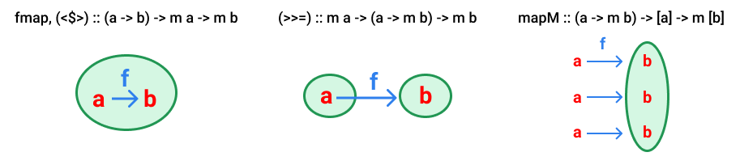

# Mapping Functions



This visual shows how I like to visualize some Monad methods. The green circle
represents the Monad and each diagram shows how the function `f` is applied to
the input.

## fmap

The `fmap` function works within the Monad to modify the input. The function
`f` doesn't know it's being used in a Monad; it only knows that it's taking an
input of type `a` and turning it into type `b`.

```
fmap (* 2) (Just 1) == Just 2
fmap (* 2) Nothing == Nothing

-- `<$>` is the infix version of `fmap`
(* 2) <$> Just 1
(* 2) <$> Nothing
```

## >>=

The bind operator takes the value inside of a Monad and returns a new Monad
based on that value.

```
-- Only divide by 2 if `x` is even.
divideTwo :: Int -> Maybe Int
divideTwo x = if x `mod` 2 == 0
  then Just $ x `div` 2
  else Nothing

(Just 1 >>= divideTwo) == Nothing
(Just 10 >>= divideTwo) == Just 5
-- the bind operator for Maybe shortcircuits on Nothing
(Nothing >>= divideTwo) == Nothing
```

As you can see, the bind operator usually has a sense in when to abort the
computation; in `Maybe`, it will stop at the first `Nothing`. In `IO`, it
will stop at an exception.

## mapM

This is like a normal `map` for lists, except the function returns a monad.
Now, the entire returned list is wrapped in the monad, instead of each element
in the list being wrapped in a monad.

```
map divideTwo [1, 2, 10] == [Nothing, Just 1, Just 5]
mapM divideTwo [2, 10] == Just [1, 5]

-- since one of the functions (divideTwo 1) evaluates to Nothing, the whole
-- expression evaluates to Nothing
mapM divideTwo [1, 2, 10] == Nothing
mapM divideTwo [2, 3, 10] == Nothing
```

If you don't care about the result, you can use `mapM_`:

```
-- has type of `IO [()]`, which we probably don't want
mapM putStrLn ["a", "b", "c"]

-- has type of `IO ()`, which is what we want
-- (short for `putStrLn "a"; putStrLn "b"; putStrLn "c"`)
mapM_ putStrLn ["a", "b", "c"]
```
